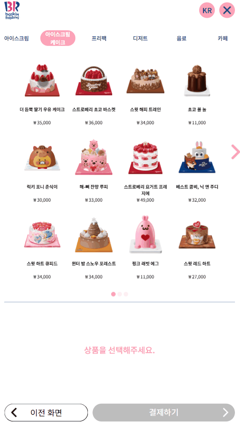
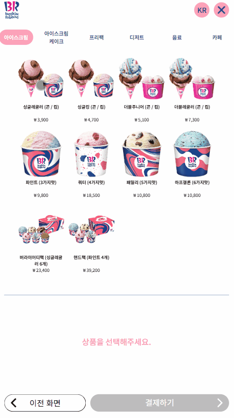
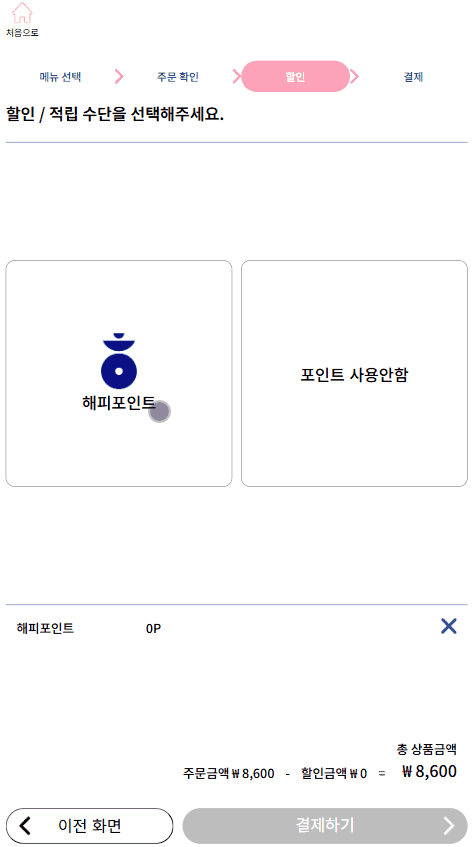

# 🍨 베스킨 라빈스31 키오스크
일상에서 자주 접하는 키오스크를 직접 제작해보고자 베스킨 라빈스31을 선정하여 키오스크를 리뉴얼했습니다.

## 🛠️ 기술스택
- React
- Redux Toolkit
- React Router
- Styled-components

## 📌 주요기능
- 상품 클릭 시 장바구니에 수량이 자동 갱신
- 아이스크림 카테고리 선택(콘/컵)에 따라 맛 선택 페이지에서 선택한 아이템이 장바구니에 아이콘으로 표시
- 포인트 확인: 휴대폰 번호 입력 시 랜덤한 포인트 발급
- 포인트 사용 시 총 상품 금액에서 해당 포인트만큼 자동 차감

## 📦 컴포넌트 구조
<pre>
baskin_robbins/
  ├── src/
    ├── component/            # 재사용 가능한 컴포넌트
      ├── data.js             # 모든 상품의 데이터
      ├── DiscountPage.js     # 할인 페이지
      ├── Footer.js           # Footer 기본 틀
      ├── Header.js           # 공용 Header
      ├── IceCreamPage.js     # 아이스크림 카테고리 맛 선택 페이지
      ├── IceCreamData.js     # 아이스크림 맛 데이터
      ├── MainPage.js         # 메인 페이지
      ├── Modal.js            # 모달 기본 틀
      ├── OrderChkPage.js     # 상품 확인 페이지
      ├── PayPage.js          # 결제 페이지
      ├── store.js            # 장바구니 상태관리
      ├── swiper.css          # swiper 스타일
      └── WelcomePage.js      # 처음 보여지는 페이지
</pre>

## 🧠 설계 및 구현 과정
### 1. UI 컴포넌트 분리
Footer와 Modal을 분리하여 재사용성과 유지보수성을 고려했습니다.
```jsx
export default function Footer({children, onPrev, onNext, nextText="결제하기"}) {
  return (
    <footer>...</footer>
  );
}
```
```jsx
const Modal = ({children, title, confirmText, onConfirm, cancelText, onCancel}) => {
  return (
    <div>...</div>
  );
}
```

### 2. 상태관리 분리
장바구니(cart)와 포인트(point)를 별도의 slice로 분리하여 Redux Toolkit으로 상태를 관리했습니다.  
- **cart slice**: 상품 추가/삭제, 수량 조절, 아이스크림 옵션 선택, 맛 선택, 장바구니 초기화 기능  
- **point slice**: 포인트 저장 및 초기화 기능  
- 전역 상태로 관리하여 페이지 전환 시에도 상태 유지

| 장바구니 Count수량 증가 |
|:--:|
|    |

```javascript
const cart = createSlice({
    name: 'cart',
    initialState: [],
    reducers: {
        addItem(state, action){ ... },
        deleteItem(state, action){ ... },
        ...
    }
});
const point = createSlice({
    name: 'point',
    initialState: 0,
    reducers: {
        setPoint: (state, action) => action.payload,
        clearPoint: () => 0,
    }
});
```

#### 🔧 트러블슈팅: 장바구니 수량 문제
#### 개선 전
> 신규 상품 추가 시 count가 없어 수량 관리가 불가능
```javascript
 addItem(state, action){
    const index = state.findIndex((findId) => findId.id === action.payload.id);
    if(index > -1){
        state[index].count++;
    }else{
        state.push(action.payload);
    }
}
```

#### 개선 후
> 신규 상품도 count를 1로 초기화하여 개별 수량 관리 가능
```javascript
 addItem(state, action){
    const index = state.findIndex((findId) => findId.id === action.payload.id);
    if(index > -1){
        state[index].count++;
    }else{
        state.push({...action.payload, count: 1});
    }
}
```

### 3. 데이터 분리
- 모든 상품 정보와 아이스크림 맛 데이터는 별도의 JS 파일로 분리
- 재사용성과 유지보수성 향상

#### data.js
> **flavor**: 아이스크림 맛 선택 갯수
```javascript
export const menu = [
  {
    id: 1,
    category: '아이스크림',
    name: '싱글레귤러 (콘 / 컵)',
    price: 3900,
    img: process.env.PUBLIC_URL + '/images/single.png',
    flavor: 1,
  },
  {
    id: 11,
    category: '아이스크림 케이크',
    name: '더 듬뿍 딸기 우유 케이크',
    price: 35000,
    img: process.env.PUBLIC_URL + '/images/cake01.png',
  },
  ...
];
```

#### IceCreamData.js
```javascript
const iceCream = [
    {
        id: 1,
        category: '초콜릿',
        name: '초콜릿 무스',
        img: process.env.PUBLIC_URL + '/images/ice_cream01.png',
    },
    {
        id: 2,
        category: '디저트',
        name: '아이스 꼬북칩',
        img: process.env.PUBLIC_URL + '/images/ice_cream02.png',
    }
    ...
];
```

### 4. 상품 선택 및 장바구니 기능
- 전체 메뉴에 아이스크림 카테고리만 뽑아서 필터링
- 사용자가 콘 혹은 컵을 선택하면 handleOption을 통해 setOption에 저장
- 선택된 옵션을 selectedOption에서 가져와 Footer에 나열
- 선택된 옵션(콘/컵) 아이콘을 맛 개수만큼 반복

| 아이스크림 (콘/컵) 선택 |
|:--:|
|    |

#### MainPage.js
> 아이스크림 카테고리만 뽑아서 필터링
```javascript
// 카테고리 선택
const categories = [...new Set(menu.map(m => m.category))];
const filteredItems = menu.filter(item => item.category === currentCategory);

// 콘/컵 선택 후 옵션 저장
const handleOption = (option) => dispatch(setOption(option));

// Footer에서 장바구니 상태에 따른 이동 처리
const handleNext = () => {
  const coneCupIds = [1,2,3,4];
  const conCupChk = cart.some(item => coneCupIds.includes(item.id) && !item.option);
  ...
}
```

#### IceCreamPage.js
> 선택된 옵션 표시
```javascript
// Footer에 장바구니 아이템과 선택된 옵션 표시
<Footer onPrev={() => {dispatch(resetFlavor()); navigate('/main/아이스크림');}} nextText={'결제하기'} onNext={handleNext}>
  <div style={{display: 'flex', gap: '20px'}}>
    {selectedOption.map((cartItem) => (
        ...

        // 선택된 옵션(콘/컵)에 따라 이미지와 맛 개수만큼 아이콘 반복
        {Array.from({ length: cartItem.flavor }).map((_, i) => (
          <div key={i}>
            {cartItem.option === '콘' && (
              
            )}
            {cartItem.option === '컵' && (
              
            )}
          </div>
        ))}
      </div>
    ))}
  </div>
</Footer>
```

#### 🔧 트러블슈팅: 맛 선택 개수
#### 개선 전
> 맛 개수별로 상품 객체를 따로 만듦
```javascript
const menu = [
  {
      id: 1,
      category: '아이스크림',
      name: '싱글레귤러 (콘 / 컵)',
      price: 3900,
      img: process.env.PUBLIC_URL + '/images/single.png',
  },
  {
      id: 2,
      category: '아이스크림',
      name: '싱글킹 (콘 / 컵)',
      price: 4700,
      img: process.env.PUBLIC_URL + '/images/single.png',
  },
  ...
];
```

#### 개선 후
> flavor 속성을 추가해 한 객체 안에서 관리하도록 개선
```javascript
const menu = [
  {
      id: 1,
      category: '아이스크림',
      name: '싱글레귤러 (콘 / 컵)',
      price: 3900,
      img: process.env.PUBLIC_URL + '/images/single.png',
      flavor: 1,
  },
  {
      id: 4,
      category: '아이스크림',
      name: '더블레귤러 (콘 / 컵)',
      price: 7300,
      img: process.env.PUBLIC_URL + '/images/double.png',
      flavor: 2,
  },
  ...
];

// flavor 개수만큼 선택 가능
 const handleFlavorClick = (flavor) => {
   ...
   dispatch(updateFlavor({id:targetId, selectedFlavor: flavor}));
 };
```

### 5. 포인트 기능
- **전화번호 입력**: 사용자 입력 최대 11자리 제한, 하이픈 자동포맷
- **랜덤 포인트 발급**: 1000~4000 포인트 발급, 모달에 발급 포인트 표시
- **포인트 적용**: 장바구니에 포인트가 적용되며 총 상품 금액에서 해당 포인트만큼 자동 차감
- **포인트 취소**: 전역 상태와 장바구니 적용 포인트 초기화

| 포인트 적용 / 취소 |
|:--:|
|    |

#### DiscountPage.js
> 전화번호 입력 / 취소
```javascript
// 입력된 번호 저장
const [num, setNum] = useState('');

// 최대 11자리 제한
const handleNumClick = (valuse) => {
        if(num.length + valuse.length >= 12) return;
        setNum(prev => prev + valuse);
    };

// 입력 삭제
const handleNumRemove = () => {
    setNum(prev => prev.slice(0, -1));
};

// 글자 수에따라 하이픈 위치 조정
const formatNum = (string) => {
    if(string.length <= 3) return string;
    if(string.length <= 7) return `${string.slice(0, 3)}-${string.slice(3)}`;
    return `${string.slice(0, 3)}-${string.slice(3, 7)}-${string.slice(7)}`;
};

// 모달창 닫으면 입력 초기화
const handleCancel = () => {
    setNum('');
    setIsModalOpen(false);
}
```

>포인트 적용 / 취소
```javascript
// 사용자가 받은 랜덤 포인트
const [userPoint, setUserPoint] = useState(0);

// 장바구니에 적용된 포인트
const [appliedPoint, setAppliedPoint] = useState(0);

const handleConfirm = () => {
  ...
  // 1000~4000 포인트 랜덤지급 
  const randomPoint = (Math.floor(Math.random() * 7) * 500) + 1000;

  // 휴대전화 번호 초기화
  setNum('');
  // 랜덤 포인트 저장
  setUserPoint(randomPoint);
};

// 전역 상태에 포인트 저장, 장바구니에 포인트 업데이트
const handlUsePoint = () => {
  dispatch(setPoint(userPoint));
  setAppliedPoint(userPoint);
  setIsPointModal(false);
};

// 전역 상태 초기화, 장바구니 포인트 초기화
const handleRemovePoint = () => {
  dispatch(clearPoint());
  setAppliedPoint(0);
  setUserPoint(0);
}
```
